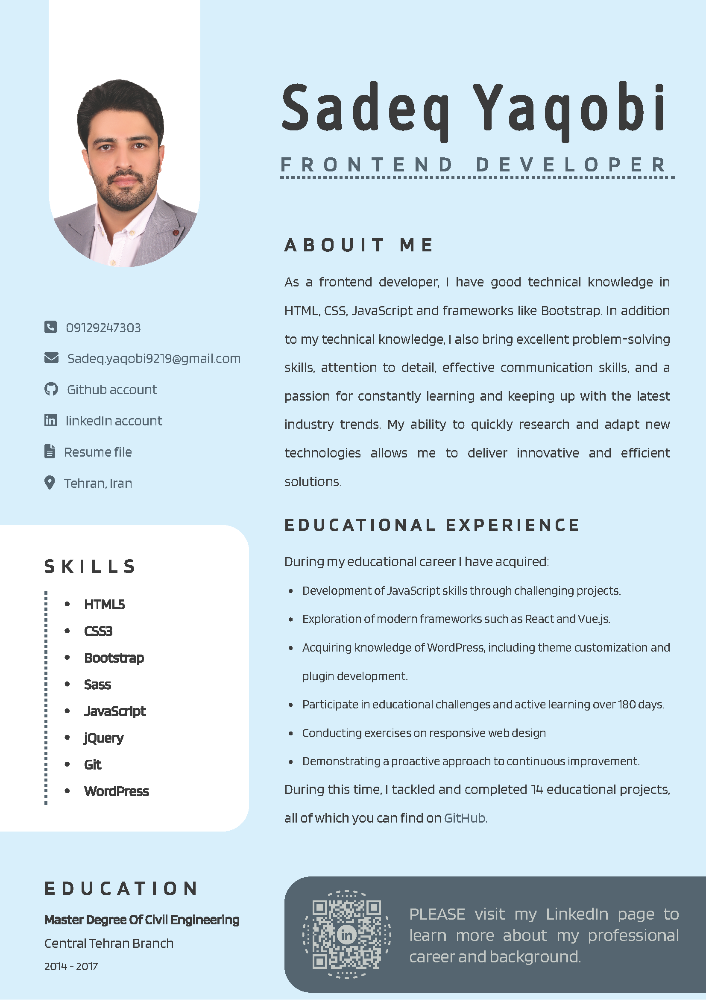

# Resume

This repository contains my professional resume.

  

## Description

This resume showcases my skills, experience, and qualifications. It provides an overview of my education, work history, projects, and relevant skills.

## Table of Contents

- [Installation](#installation)
- [Usage](#usage)
- [License](#license)
- [Contact](#contact)

## Installation

To access my resume, you can simply download the PDF file or click the following link to view it online: [Resume PDF](assets/doc/sedeq-yaqobi-resume-HS.pdf).

## Usage

My resume provides a comprehensive overview of my professional background and skills. It can be used for various purposes, including job applications, networking, and showcasing my qualifications to potential employers or clients.

## License

This project is licensed under the [MIT License](https://opensource.org/licenses/MIT).

## Contact

If you have any questions or would like to get in touch, you can reach me at:

- Email: sadeq.yaqobi9219@gmail.com
- LinkedIn: [Sadeq Yaqobi](https://www.linkedin.com/in/sadeq-yaqobi)
- GitHub: [sadeq-yaqobi](https://github.com/sadeq-yaqobi)
